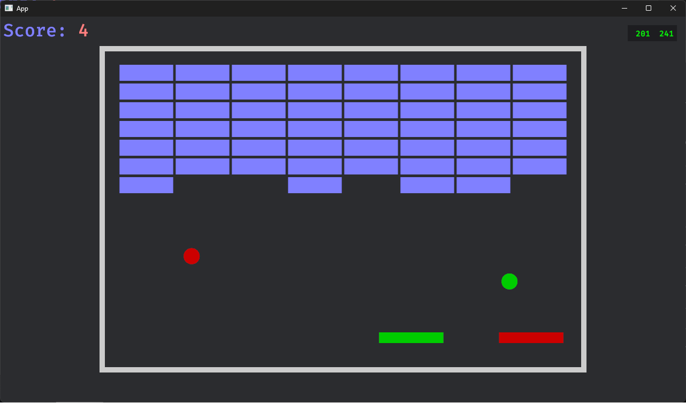
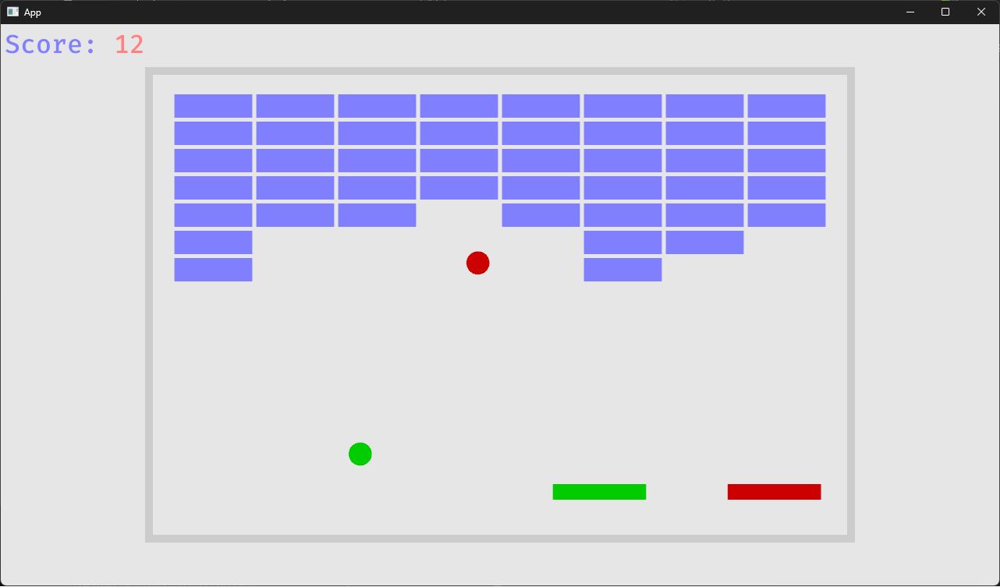

# What
This project takes breakout.rs from bevy's [examples](https://github.com/bevyengine/bevy/blob/main/examples/games/breakout.rs) and makes it networked multiplayer using a client-server model

Picture of a client in a game with 2 players:

The server also renders the game for demonstration purposes. It will have a white background:

By default, server and client bind and connect to localhost. To change this, use the `--bind` option to specify a connection string for the server and the `--ip` and `--port` options on the client to control where to connect.

Clients also have the ability to simulate latency, and turn off prediction. Run `client.exe --help` to see latest options.

# How
### Basics
Clients send only inputs up to the server. The server broadcasts world state down to clients. Both client and servers run at a fixed 60 hz, and send one packet per tick. The client interpolates between the two most recently received world states when rendering. This is commonly called a 'snapshot interpolation' model for synchronizing game state.

### Client prediction
In order to mitigate latency, by default the client predicts both its local paddle and all ball physics. When receiving world states, the local paddle and all balls are rolled back to that state and forward predicted for each un-acknowledged input. This process is commonly called 'rollback'. In many shooters, this is done for the local player. In some games (like rocket league) it is done for all players.

### Tradeoffs
This model provides responsive input for the local player, at the cost of potential mispredictions around ball collisions with remote players' paddles.

# Why
Because I wanted to learn the basics of various netcode models.

# Reference
Snapnet blog: https://snapnet.dev/blog/

Gaffer on games: https://www.gafferongames.com/

# Building
`cargo build --bin client --bin server`